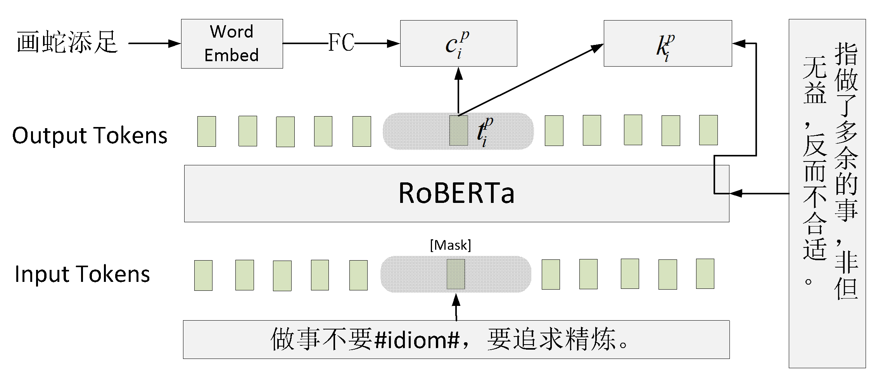

# 基于对比学习的中文成语完型填空

[project_link](https://github.com/Zehong-Ma/ChID-CL)

## 1. 实验目的

### 1.1 实验任务

本项目采用ChID中文成语完型填空数据集，要求模型能够从一系列成语候选中选择最正确的成语填入语篇的特定位置。

```
{
    "groundTruth": ["一目了然", "先入为主"], 
    "candidates": [["明明白白", "添油加醋", "一目了然", "残兵败将", "杂乱无章", "心中有数", "打抱不平"], ["矫揉造作", "死不瞑目", "先入为主", "以偏概全", "期期艾艾", "似是而非", "追根究底"]], 
    "content": "【分析】父母对孩子的期望这一点可以从第一段中找到“即使是学校也只是我们送孩子去接受实用教育的地方，而不是让他们为了知识而去追求知识的地方。”至此，答案选项[C]#idiom#。而选项[B]显然错误。选项[A]这个干扰项是出题人故意拿出一个本身没有问题，但是不适合本处的说法来干扰考生。考生一定要警惕#idiom#的思维模式，在做阅读理解的时候，不能按照自己的直觉和知识瞎猜，一定要以原文为根据。选项[D]显然也是不符合家长的期望的。", 
    "realCount": 2
}
```

如上所示，在`content`中有两处`#idiom#`标志。以第一个标志处为例，模型要从候选成语`["明明白白", "添油加醋", "一目了然", "残兵败将", "杂乱无章", "心中有数", "打抱不平"]`选择最合适的成语`一目了然`填入此处。

数据集：本文数据集ChID由 **[ChID: A Large-scale Chinese IDiom Dataset for Cloze Test](https://www.aclweb.org/anthology/P19-1075)** 提出。训练集包含句子50w条，验证集和测试集各有2w条句子。[下载链接（北大网盘）](https://disk.pku.edu.cn:443/link/3510A73BA4793A830B0179DF795330C8)

### 1.2 实验动机（Motivitation）

#### 基准模型存在的问题

1. **成语应当当作一个整体去理解**而不是一个字一个字，一个字一个字去理解预测可能带来**两个问题**：

* 每个成语的字旁边跟什么字，搜索空间太大，不易搜索到合适的字，汉语的字有21128个，四个字全部预测正确的随机概率为$(\frac{1}{21128})^4$，概率很小，即使考虑到不同字旁边出现的字的概率是不一样的，这极可能是一个极小的概率。
* 成语中，一字之差可能导致意思截然不同，这样的成语并不稀少，例如成语：
  * 不孚众望：不能为众人所信服；不负众望： 没有辜负大家的期望。
  * 不以为然：不认为是正确的；不以为意：不放到心上。

2. **一个成语可能有多个意思**，单凭一个一个字去理解成语可能存在问题，例如成语。
   * 灯红酒绿：形容寻欢作乐的腐化生活；也形容都市或娱乐场所夜晚的繁华热闹的景象。

3. **不能光凭字的表面去理解成语**，单凭一个一个字去理解成语可能存在问题：

* 存在很多字和意思并不匹配的成语，例如很多成语来自用典，其字和意思存在很大的差距：
  * 塞翁失马
  * 高山流水
  * 曲高和寡

#### 解决办法

1. 把成语当成一个整体的token去理解和预测，而不是四个token。
2. 引入新华词典中成语的解释来帮助理解成语的语义。

## 2. 实验原理（模型介绍）

### 2.1 基准模型(Baseline)


>[baseline模型](https://github.com/Zce1112zslx/ChID_baseline)基于预训练模型中常用的掩码语言模型（Masked Language Modeling）实现，采用中文roberta作为backbone。
>
>我们将`#idiom#`替换为`[MASK][MASK][MASK][MASK]`，通过LM head输出每个`[MASK]`处的token在候选字上的概率分布，并以此选择概率最高的成语。
>
>对于上方的例子，第一个`[MASK]`处的token将会通过LM head得到所有候选成语第一个字上（明，添，一，残，杂，心，打）的概率分布，对于其他`[MASK]`处的token，也可以用同样方法得到模型在对应7个候选字上的概率分布。
>
>`#idiom#`处填成语一目了然的概率就是每个`[MASK]`处分别填写对应字（一、目、了、然）概率的乘积；候选中概率最高的成语就是最终的预测结果。
>
>具体实现代码参见`model.py`。

### 2.2 对比学习模型CoM（Contrastive Method）


* 给成语整体加一个`[Mask]`，也就是直接预测成语整体。

* 成语（图中的例子为：画蛇添足）经过**Word Embed**的模块后得到成语对应的`Word Embedding`，经过FC层微调的到成语向量$C_i^p$。

* 利用对比学习约束$L_1$，拉近成语向量$c_i^p$和`[Mask]`预测出的词向量$t_i$的距离（拉近正样本对），并同时拉远$t_i$和其它非目标成语$c_j(c_j\neq c_i^p)$之间的距离（拉远负样本对）。

    

* 利用对比学习约束$L_2$，拉近成语向量$c_i$和$c_i^p$的距离（正样本），并同时拉远$c_i$和其它非目标成语$c_j(c_j\neq c_i^p)$之间的距离（负样本）。    

    

* 两个Loss函数相加。

    

### 2.3 基于额外知识的对比学习模型CoMEK（CoM with Extra Knowledge）



* 给成语整体加一个`[Mask]`，也就是直接预测成语整体。

* 成语（图中的例子为：画蛇添足）经过**Word Embed**的模块后得到成语对应的`Word Embedding`，经过FC层微调的到成语向量$C_i^p$。

* 利用对比学习约束$L_1$，拉近成语向量$c_i^p$和`[Mask]`预测出的词向量$t_i$的距离（拉近正样本对），并同时拉远$t_i$和其它非目标成语$c_j(c_j\neq c_i^p)$之间的距离（拉远负样本对）。

    

* 利用对比学习约束$L_2$，拉近根据`[Mask]`预测的向量$t_i$和对应的句子解释之间的$k_i^p$的距离（正样本），并同时拉远$t_i$和其它非目标成语的解释$k_j(k_j\neq k_i^p)$之间的距离（负样本）。

    

* 两个Loss函数相加。

    


## 3. 实验内容（实验步骤）

### 3.1 实验环境

+ 软件环境：torch 1.12, cuda11.3, python 3.10
+ 硬件环境：NVIDIA GeForce 1080ti*8

### 3.2 构建引入成语Token的Tokenizer

```shell
# generate idiom token ids and corresponding idiom's explainations.
python preprocess/process_xinhua_corpus.py
# merge manually with the tokenizer in data/my_tokenizer.(Save the RoBERTa pretrained tokenizer firstly and then add the idiom tokens into the tokenizer. The processed tokenizer can be directly loaded into the model , so you can just download  my_tokenizer and use it off the shelf.)
```

### 3.3 训练CoM模型

+ CoM模型的实现在[idom_token.py](./idom_token.py)和[contrastive_model.py](./contrastive_model.py)中，具体数据预处理，模型实现和损失函数设计请见代码。训练方式如下：

```
sh train_CoM.sh
```

### 3.4 训练CoMEK模型

+ CoM模型的实现在[idom_token_together.py](./idom_token_together.py)和[contrastive_model.py](./contrastive_model_with_idiom.py)中，具体数据预处理，模型实现和损失函数设计请见代码。训练方式如下：

```
sh train_CoMEK.sh
```


## 4. 实验结果

### 4.1 Baseline

| Model    | Dev   | Test  | Train scale |
| -------- | ----- | ----- | ----------- |
| Baseline | 65.29 | 65.00 | 1w          |
| Baseline | 72.12 | 72.02 | 5w          |
| Baseline | 74.50 | 74.50 | 10w         |
| Baseline | 80.69 | 80.68 | all         |

+ 首先我们对baseline进行了复现，发现效果基本与[ChID_Baseline](https://github.com/Zce1112zslx/ChID_baseline)的相近。

### 4.2 CoM和CoMEK实验结果

+ **CoM实验结果**

| Model | Dev       | Test  | Train scale |
| ----- | --------- | ----- | ----------- |
| CoM   | 57.09     | 57.02 | 1w          |
| CoM   | 72.06     | 72.08 | 5w          |
| CoM   | 75.84     | 76.02 | 10w         |
| CoM   | **83.12** | 83.10 | all         |

+ **CoMEK实验结果**

| Model | Dev       | Test      | Train scale |
| ----- | --------- | --------- | ----------- |
| CoMEK | 63.98     | 64.1      | 1w          |
| CoMEK | **73.72** | **73.59** | 5w          |
| CoMEK | **76.81** | **76.74** | 10w         |
| CoMEK | 82.93     | **83.14** | all         |

+ 实验分析
  + 对比baseline和我们实现的两个模型，发现**CoM模型和CoMEK在10w及以上规模都超过了Baselin**e。
  + 但是从1w规模来看，baseline性能都会比我们提出的模型好，这个是合理的，因为我们把成语当成了整体的一个新的token，并且是随机初始化的，没有roberta的预训练模型，所以数据集小时无法较好的拟合成语token，而到数据量超过一定规模后，我们方法和baseline的差距就体现出来了。
  + 而CoM和CoMEK性能在大规模数据集上基本相近，因此可以认为，CoM模型最终训练得到的成语的语义与新华词典中的解释的语义应该是相近的，因为CoMEK模型中引入了新华词典的解释。 

### 4.3 消融实验

| Model | Contrast in sample | Contrast in batch | Use MLP projection | Train scale | Val   | Test  |
| ----- | ------------------ | ----------------- | ------------------ | ----------- | ----- | ----- |
| CoM   | √                  |                   |                    | 1w          | 44.77 | 44.78 |
| CoM   |                    | √                 |                    | 1w          | 47.80 | 47.61 |
| CoM   |                    | √                 | √                  | 1w          | 57.09 | 57.02 |

+ `Contrast in sample`代表对比学习只在当前样本的7个Candidate之间进行，即只有1个正样本，6个负样本。
+ `Contrast in batch `代表对比学习在当前`mini-batch`的$7\times batch\_size$个Candidate之间进行，即有1个正样本，$(7\times batch\_size-1)$个负样本。
+ `Use MLP projection`表示在做对比学习时，成语向量$c_i^p$需要将`Word Embed模块`（nn.Embedding）映射得到的成语向量再经过几层MLP进行拟合，这里使用了18层残差全连接。（深度越深，效果越好，对于idiom embedding能有更强的解释能力和表达能力，后续可以改进这个module来提高性能。）

+ 通过以上消融实验，可以得出，对比学习负样本数量越大，学习到的特征越好，效果越好；直接通过nn.Embedding查找得到的idiom embedding表达能力有限，需要引入额外module进行编码。

## 实验过程总结与感想

* 马泽红：
  + 在此次大作业中，从最初的motivation到最终的实现，和其他组员共同合作，一起完成了CoM和CoMEK的实现，对于Hugging Face的使用、BERT模型、对比学习和Mask Language Modeling自监督训练任务有了一个更加深入的了解。
  + 在模型搭建初期，数据预处理，尤其是对Tokenizer继承和改造，是一个比较麻烦的事情，最终通过保存预训练Tokenizer加手动合并成语字典的方式半实现了my_tokenizer，这个tokenizer可以处理3w+不同的成语，远大于ChID数据集中的3848个词，因此my_tokenzier可以直接迁移到和成语相关的任务上。
  + 在CoM模型实现过程中，重点在于如何构建正负样本，通过对比`Contrast in sample`和`Contrast in batch`两种方式，我们选取了batch内对比学习的方式，更多的负样本会帮助学习到更好的成语特征（idiom embedding）。
  + 在CoMEK模型中，其他队员尝试过使用成语解释来初始化idiom embedding，但是并没有效果。于是我们引入成语解释作为新的对比学习特征，让`[Mask]`对应的句子级特征$t_i$与$k_i^p$进行匹配，最终预测的结果也需要考虑成语释义层面的特征，最终做出预测时的相似度为$t_i$与$c_i^p$、$k_i^p$的相似度均值。但是$t_i$、$c_i^p$和$k_i^p$之间的$C_3^2+C_3^3=4种$对齐关系和依赖关系并没有进入更加深入的挖掘，可能会存在更加有效的对比学习对齐方式，这也是对比学习可以改进的地方。
* 申海洋：
  * 此次大作业中，完整实现了一个深度学习任务从发现问题、提出自己的想法、到付诸实践的全过程，和队长马泽红，以及尹望嵩同学一起实现了CoM和CoMEK的实现，对于BERT模型、对比学习和Mask Language Modeling的自监督训练任务有了更加深入和细致的了解。
  * 在最初拿到baseline的时候，我们认为模型的预测结果有差距，应该优化训练出的成语和句子的表示，要从哪个方面来让学习的词嵌入效果更好呢？我们尝试了使用成语解释来初始化idiom embedding等方法，但都没有取得我们预期的效果。于是在CoMEK中我们诉诸于引入成语解释作为新的对比学习的特征，让`[Mask]`对应的句子特征和成语的解释、成语进行匹配，最终在较大的数据集上取得了不错的训练效果。后面还有值得继续改进的地方，比如我们认为对比学习的对齐方式可能有更加高效的、有效的方法，加的`[Mask]`，使用的计算`Loss`的方法都值得探究。
  * 在实现对比模型的时候，如何构建正负样本，怎么样构建正负样本都需要仔细的斟酌考虑，我们最终选取了batch内对比学习的方式，我们发现，更多的负样本会帮助学习到更好的特征，取得更好的预测效果。
* 尹望嵩：

## 实验分工

| 姓名   | 实验分工                                                     |
| ------ | ------------------------------------------------------------ |
| 马泽红 | 统筹全局、把控设计方向、把控实验方向、模型设计、实验、实验报告、ppt讲解 |
| 申海洋 | 设计方向探讨、实验内容探讨、模型设计、实验、环境配置、实验报告 、viso绘图|
| 尹望嵩 | 提供实验设备、环境配置、设计方向探讨、实验内容探讨、模型设计、实验、ppt制作 |

## 未来工作

* 用更大的batch size进行对比学习。
* 对MLP projection的module进行替换，增加idiom embedding的表达能力，更好的反映句子的意思。
* 去深入挖掘成语词向量$c$，句子级语义$t$和成语解释词向量$k$之间的关系。

## Reference:

+  [CHID_baseline](https://github.com/Zce1112zslx/ChID_baseline)

+ [Chinese-Xinhua](https://github.com/pwxcoo/chinese-xinhua)